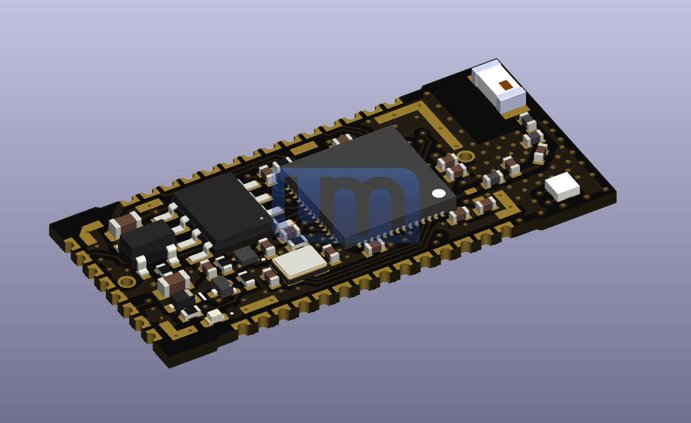
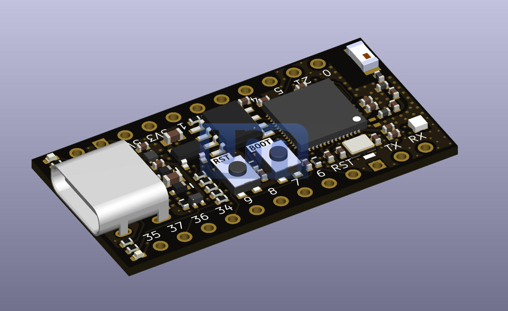
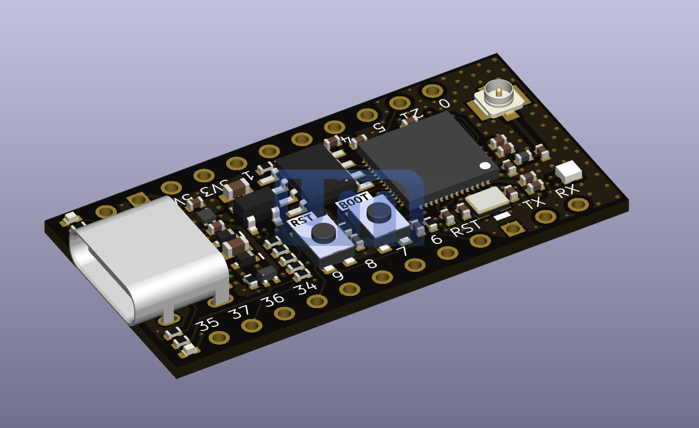
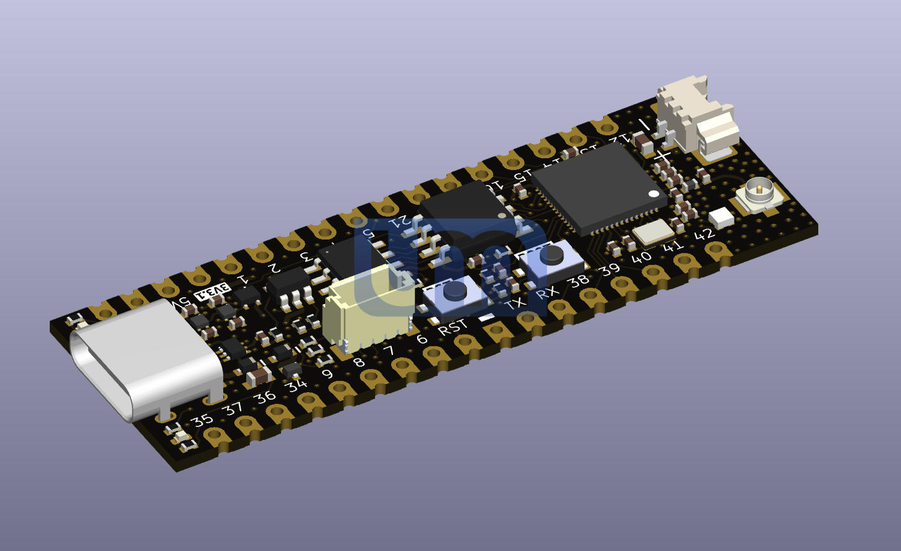
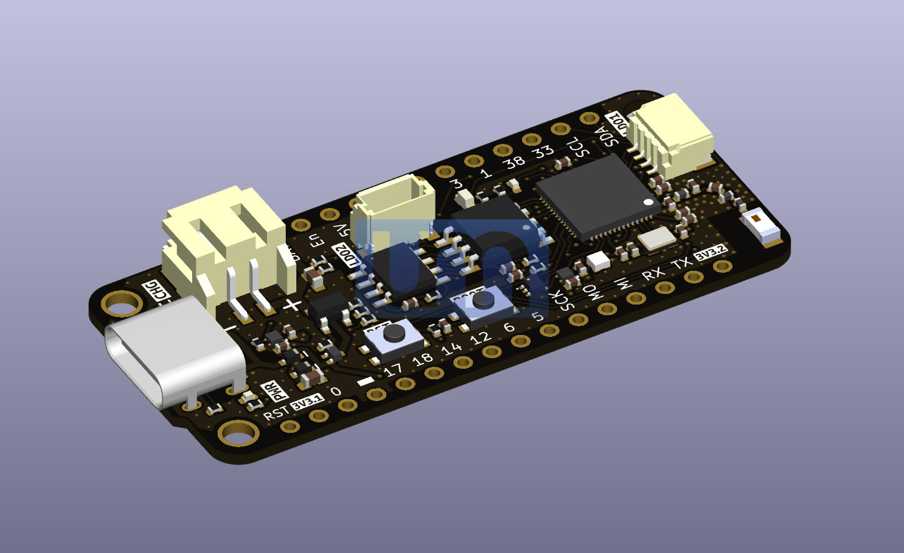
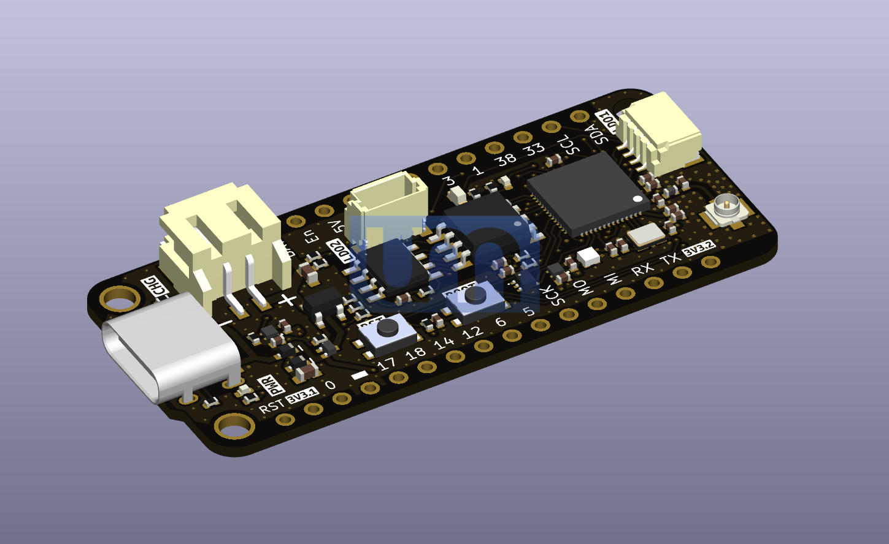
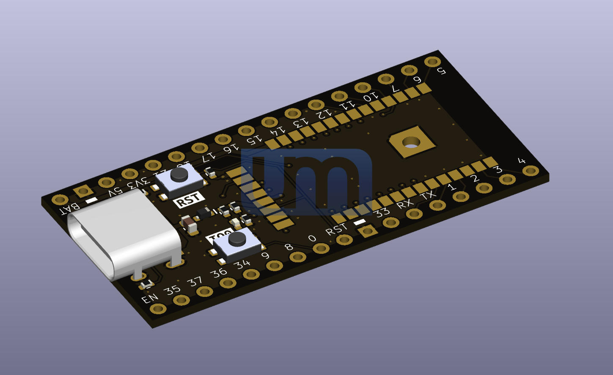
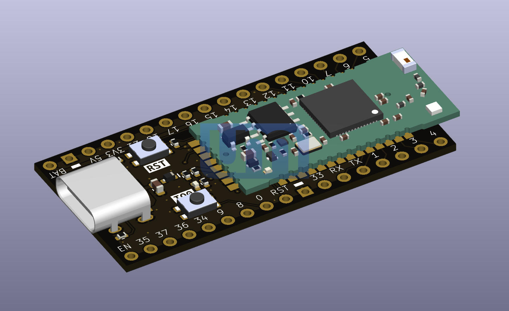

# 3D models - Unexpected Maker - ESP32-S3 Boards 
3D STEP models and reference images of my ESP32-S3 boards  

You can find out more about my ESP32-S3 boards at https://esp32s3.com 

Artwork and content in this folder is (c)2022,2023 Unexpected Maker, all rights reserved.

### NanoS3

### TinyS3 & TinyS3 uFL

    
    

### ProS3 & ProS3 uFL

    
    

### FeatherS3 & FeatherS3 uFL

    
    

### NanoS3 Carrier

    
    

